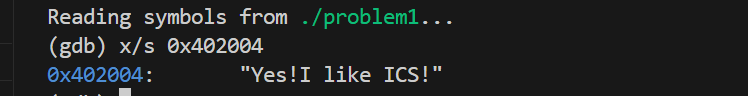
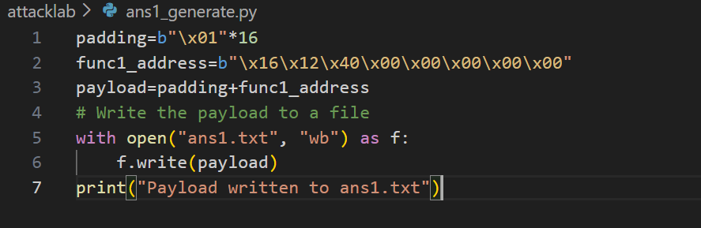
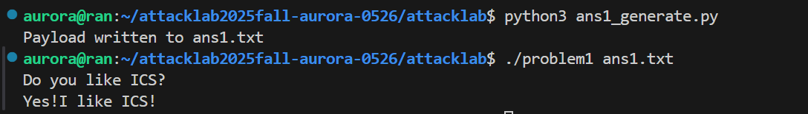
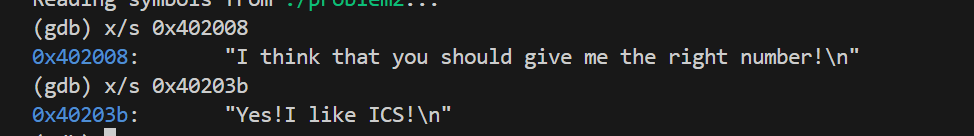
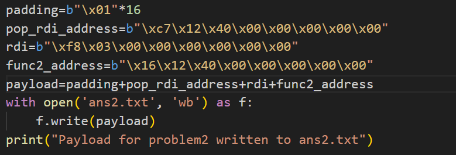
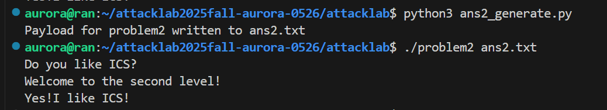
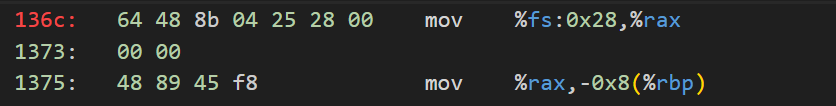
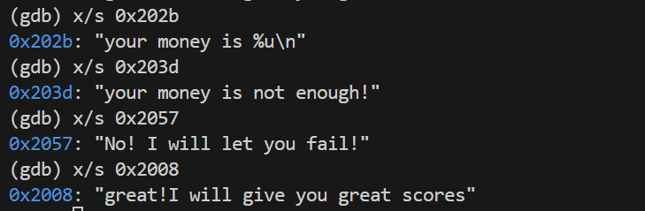
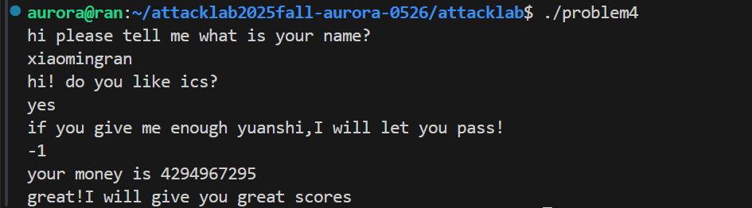

# 栈溢出攻击实验
姓名：肖鸣冉
学号：2024201525

## 题目解决思路

### Problem 1: 
- **分析**：
  - 注意到在main函数中调用了func函数；
  - 在func函数中，调用了strcpy函数，注意到这里是可能导致缓冲区溢出的地方；
  - 在func1函数中，会调用puts(%edi)函数，猜测%edi中存的地址处，即0x402004处可能为要输出的内容，用gdb查看0x402004地址处的字符串，发现就是目标输出内容；

  
  - 因此，就要使func函数中strcpy的函数填入的字符串覆盖住func的返回地址，使其跳转到func1函数处；
- **解决方案**：
  - func函数中，strcpy的第一个参数指向%rbp-0x8，第二个参数指向%rbp-0x18，strcpy会将后面一个参数复制给第一个参数；
  - %rbp-0x8距return address的距离为0x8+0x8（old %rbp的大小）=16B；
  - 用padding填满这16个字节，设置padding为 padding=b"\x01"*16;
  - 再用func1的地址小端序填入return address，func1_address=b"\x16\x12\x40\x00\x00\x00\x00\x00"
  - 最终的payload为padding+func1_address

  
- **结果**：

### Problem 2:
- **分析**：
  - 注意到在main函数中调用了func函数；
  - 在func函数中调用了memcpy函数，这里可能导致缓冲区溢出；
  - 通过gdb，发现要输出的目标字符串存储在0x40203b地址处：

  
  - 在func2中调用了函数printf(0x40203b)：
    - 在func2中有两个printf：
      - 如果%edi==0x3f8，就会跳转到0x40124c处，调用函数printf(0x40203b)，输出目标内容；
      - 否则，调用函数printf(0x402008)，不会输出目标内容；
  - 如何让保证调用func2函数时使%edi的值为0x3f8？
    - 注意到有函数pop_rdi；
    - 其中，0x4012c7处会将栈顶元素pop出来，赋值给%rdi，可以通过这个改变%rdi的值；
    - 同时，此函数return时，可以让其跳转到func2函数的地址处，输出目标内容；
- **解决方案**：
  - func函数中，memcpy第一个参数指向%rbp-0x8处，第二个参数指向%rbp-0x18处；
  - 调用memcpy函数时，可以改变第一个参数的值，使其覆盖func函数的返回地址；
  - 第一个参数距离return address的距离为0x8+0x8（old %rbp的大小）=16B；
  - 用padding填满这16个字节，设置padding为 padding=b"\x01"*16；
  - 根据上面的分析，在调用func2函数之前，先要设置%rdi的值，通过覆盖func函数的返回地址，使其跳转到pop_rdi函数中pop的地方，设置 pop_rdi_address=b"\xc7\x12\x40\x00\x00\x00\x00\x00"；
  - 跳转到pop_rdi函数内部之后，会将栈顶的8B弹出，赋值给%rdi，而%edi的值要为0x3f8，设置这8个字节内容为 rdi=b"\xf8\x03\x00\x00\x00\x00\x00\x00"；
  - 然后，pop_rdi函数return，进行pop+jump操作，要使其跳转到func2函数处，因此，栈顶元素应为func2函数的地址，设置 func2_address=b"\x16\x12\x40\x00\x00\x00\x00\x00"；
  - 因此，payload应为padding+pop_rdi_address+rdi+func2_address；

  
- **结果**：

### Problem 3：
目前还没完成

### Problem 4: 
- **分析**：
  - canary为金丝雀，是一种栈破坏检测；
  - 其在被调用者的栈帧中存储一段来自只读数据段的内容，其原始值不可被修改，不可被直接获取，在汇编代码中的体现为：

  
  - 在函数返回前，要先比较存储金丝雀的位置处的内容是否与金丝雀的值相等：
    - 如果相等，说明返回地址没有被更改，可以正确返回；
    - 否则，说明可能发生栈溢出破坏，call __stack_chk_fail；
- **解决方案**：
  - 根据README中的提示，可以不用编写代码，绕过canary的检测；
  - 通过gdb，可以发现通关提示是在0x2008处，即在func1中输出；

  
  - 观察到在func函数中，可以直接调用func1函数：
    - 在0x13df中，比较%rbp-0xc处的值与0xffffffff是否相等；
    - 如果相等，则会跳到0x13f6处，call func1，输出通关提示；
    - 因此，只要输入-1（0xffffffff）即可；
- **结果**：附上图片

## 思考与总结
- 通过这个lab让我们更深入和清晰的理解栈溢出攻击；
- 结合了对汇编的分析和对栈溢出的分析，比较综合和全面；

## 参考资料

列出在准备报告过程中参考的所有文献、网站或其他资源，确保引用格式正确。
